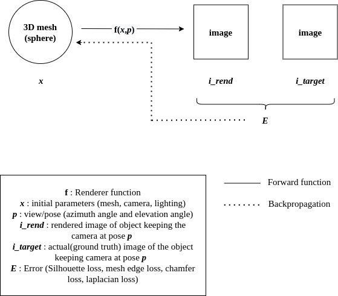
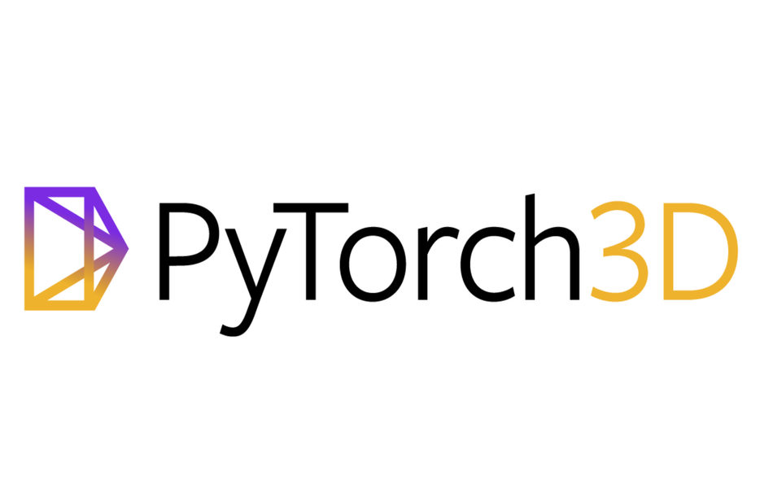

# 3D-Reconstruction from Single Image

<!-- ABOUT THE PROJECT -->
## Aim 🎯
The aim of the project is to create a 3 dimensional reconstruction (mesh) from a 2 dimensional image.
 

<figure>
  
  <figcaption>Fig.Differentiable renderer.</figcaption>
</figure>

<figure>
  
  <figcaption>Fig.Illustration of how the mesh converge.</figcaption>
</figure>
 

### Built With

 
<!-- CONTRIBUTING -->

<!-- LICENSE -->

<!-- CONTACT -->
## Contribute
<a href="https://github.com/sarathcani/3D-Reconstruction-from-Single-Image/issues/new" >Raise an issue!</a>
<!-- ACKNOWLEDGEMENTS -->
## References
<a id="1">[1]</a> 
Liu, Shichen, et al. "Soft rasterizer: A differentiable renderer for image-based 3d reasoning." Proceedings of the IEEE/CVF International Conference on Computer Vision. 2019.
